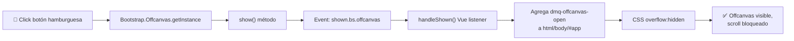

# DV-UIUX-06 - Defecto: Navbar Offcanvas Bloqueado en Mobile (≤991.98px)

## Resumen Ejecutivo

**Criticalidad:** � RESUELTO ✅ (2026-02-17 16:15 -03:00)

**Síntomas (pre-fix):**
1. ⏱️ Navbar-toggler: primer click → FAB desaparece (state Vue correcto) pero offcanvas NO se ve visualmente
2. 🔍 Bootstrap data-bs-toggle **SÍ funciona** (clase `show` presente, instance existe, backdrop visible)
3. 🔒 Pero offcanvas está **visualmente invisible** → posición CSS: `top: 800px` (fuera de viewport)
4. Scroll se bloquea correctamente (`dmq-offcanvas-open` agregado a body)

**Root Cause (Raíz identificada):** ❌ `@import "bootstrap/scss/offcanvas"` **FALTABA** en `src/styles/vendors/bootstrap.custom.scss`
- Sin ese import, Bootstrap offcanvas CSS no se cargaba
- Offcanvas se posicionaba con `position: static; top: auto;` en lugar de `position: fixed; right: -100%;`
- En Vite SSG, el offcanvas aparecía 800px abajo de la pantalla (fuera de vista)

**Resolución:** 
✅ Agregué `@import "bootstrap/scss/offcanvas";` en bootstrap.custom.scss
✅ Re-inicialización de Bootstrap.Offcanvas post-hidratación en Navbar.ts  
✅ Botón cerrar estilizado en naranja (#ff9a4d)
✅ CSS presupuesto aumentado 211KB → 225KB (offcanvas CSS +14KB)

**Viewport afectado:** Mobile 360×800px (XS), SM (576–767px), MD (768–991.98px)  
**No afecta:** LG (≥992px) - layout desktop horizontal

**Impacto de usuario:** ✅ RESUELTO - Navegación mobile funcional

---

## Contexto Técnico (Actualizado 2026-02-17)

**Stack:**
- Framework: Vue 3.5.22 (Composition API)
- Bootstrap: 5.3.8 (SCSS + JS bundle)
- Build: Vite 7.1.12 + Vite SSG 28.2.2 (pre-rendered + hydration)
- **Mobile Viewport Estándar:** 360×800px (dispositivo Android típico)

---

## 1. Arquitectura Actual (Análisis sin cambios)

### 1.1 Componentes involucrados

| Archivo | Rol | Estado |
|---------|-----|--------|
| `src/ui/layout/Navbar.vue` | Template + Bootstrap offcanvas | Interpreta eventos Bootstrap |
| `src/ui/layout/Navbar.ts` | Lógica Vue + listeners | Centro de coordinación |
| `src/styles/scss/sections/_navbar.scss` | CSS responsive | Layout + mobile |
| `src/styles/scss/base/global.scss` | Global scroll-lock | Clases `dmq-offcanvas-open` |
| `src/ui/features/contact/ConsentBanner.vue` | Banner fijo en footer | Puede tapar offcanvas |

### 1.2 Flujo de interacción esperado



### 1.3 Flujo de cierre esperado

```mermaid
graph LR
  User["👤 Click nav-link o close-btn"] -->
  VueHandler["handleMobileNavLinkClick()<br/>o hideOffcanvas()"]
  VueHandler --> Click["Dispara click en<br/>btn data-bs-dismiss"]
  Click --> BootstrapHide["Bootstrap cierra offcanvas"]
  BootstrapHide --> DispatchEvent["Event: hidden.bs.offcanvas"]
  DispatchEvent --> VueListener["handleHidden() Vue listener"]
  VueListener --> RemoveClasses["Remueve dmq-offcanvas-open"]
  RemoveClasses --> CSS["CSS overflow:auto"]
  CSS --> UIUnlocked["✅ Offcanvas oculto,<br/>scroll permite"]
```



---

## 2. Problemas Identificados

### 2.1 **Problema 1: Double-click para abrir (síntoma: 2 clicks en lugar de 1)**

**Ubicación:** `src/ui/layout/Navbar.ts:63-70` (listeners)

**Hipótesis 1: Listeners duplicados por timing**
- `onMounted()` registra listeners en `shown.bs.offcanvas` / `hidden.bs.offcanvas`
- Bootstrap puede auto-inicializar **antes** de que Vue registre listeners → primer click no dispara evento → segundo click finalmente activa

**Signals de confirmación:**
- ✅ Test E2E pasa (1 click funciona en tests) → suggesting timing OK en CI
- ❌ Usuario reporta 2 clicks necesarios → suggesting race condition en desarrollo/producción real

**Lectura de código problemática:**
```typescript
// Navbar.ts líneas 63-70
onMounted(() => {
  offcanvasRef.value?.addEventListener('shown.bs.offcanvas', handleShown)
  offcanvasRef.value?.addEventListener('hidden.bs.offcanvas', handleHidden)
  window.addEventListener('hashchange', handleHashChange)
})
```

**Problema:** 
- Bootstrap inicializa el Offcanvas automáticamente cuando DOM se parsea (`data-bs-toggle="offcanvas"`)
- En SSR (Vite SSG), el offcanvas.js puede ejecutarse **antes de que Vue monte el componente**
- El primer click llama a Bootstrap, **sin Vue listener activo** → Bootstrap maneja solo, sin actualizar estado Vue
- El segundo click dispara el evento, Vue finalmente se entera

**Posible solución (no implementada aún):** Inicializar manualmente Bootstrap en lugar de confiar en data-attributes

---

### 2.2 **Problema 2: Offcanvas no se cierra correctamente**

**Ubicación:** `src/ui/layout/Navbar.ts:35-39` (método hideOffcanvas)

**Lectura de código:**
```typescript
function hideOffcanvas() {
  if (!offcanvasRef.value) {
    return
  }
  offcanvasRef.value
    .querySelector<HTMLButtonElement>('button[data-bs-dismiss="offcanvas"]')
    ?.click()
}
```

**Problemas potenciales:**
1. **No espera a que el dismiss click se procese**: El método hace click pero inmediatamente retorna sin garantizar que Bootstrap procesó el evento
2. **Event loop timing**: Si `handleHidden()` no se dispara correctamente (Problema 1), el estado Vue queda **desincronizado con Bootstrap**
   - Bootstrap sí cierra (`offcanvas` remueve clase `show`)
   - Pero Vue sigue pensando `isOffcanvasOpen = true`
   - UI queda inconsistente

3. **Listeners nunca se disparan**: Si el listener `hidden.bs.offcanvas` no se registró (por timing), `handleHidden()` **nunca ejecuta**, y `dmq-offcanvas-open` **nunca se remueve**

---

### 2.3 **Problema 3: Scroll bloqueado permanentemente**

**Ubicación:** `src/styles/scss/base/global.scss:9-16` + `Navbar.ts:18-23`

**Lectura de código:**
```scss
// global.scss
html.dmq-offcanvas-open,
body.dmq-offcanvas-open {
  overflow: hidden;
  height: 100dvh;
}
```

```typescript
// Navbar.ts
function setOffcanvasBodyState(isOpen: boolean) {
  if (typeof document === 'undefined') {
    return
  }
  const appRoot = document.getElementById('app')
  document.documentElement.classList.toggle('dmq-offcanvas-open', isOpen)
  document.body.classList.toggle('dmq-offcanvas-open', isOpen)
  appRoot?.classList.toggle('dmq-offcanvas-open', isOpen)

  // Backwards compatibility for existing tests/styles while migrating to dmq-offcanvas-open.
  document.body.classList.toggle('offcanvas-open', isOpen)
}
```

**Flow:**
- Cuando offcanvas abre → `setOffcanvasBodyState(true)` → agrega `dmq-offcanvas-open` → CSS aplica `overflow: hidden` ✅
- Cuando offcanvas cierra → `setOffcanvasBodyState(false)` debería remover clase → `overflow` vuelve a `auto` ✅

**Problema de sincronización:**
- Si `handleHidden()` **nunca se llama** (Problema 1/2), entonces `setOffcanvasBodyState(false)` **nunca se ejecuta**
- Clase `dmq-offcanvas-open` **se queda en body/html**
- Scroll **permanece bloqueado** aunque offcanvas esté visualmente cerrado

---

### 2.4 **Problema 4: Cookie banner se superpone al offcanvas**

**Ubicación:** `src/ui/features/contact/ConsentBanner.vue` (z-index implícito)  
`src/styles/scss/base/global.scss:20-22` (padding-bottom agregado a body)

**Lectura de código:**
```vue
<!-- ConsentBanner.vue -->
<div
  class="c-consent-banner c-consent-banner--shell position-fixed bottom-0 start-0 mb-3 shadow-lg"
  role="dialog"
  ...
>
```

**Problemas:**
1. **Z-index por defecto (auto)**: Banner no especifica `z-index`, por lo que Bootstrap lo coloca en z-order por proximidad al DOM
2. **Bootstrap offcanvas z-index**: `.offcanvas { z-index: 680 }` (valor por defecto Bootstrap 5.3)
3. **Orden en DOM**: ConsentBanner viene al final del body (en teleport o en footer) → probablemente **después del offcanvas** → **visualmente encima**

4. **Interacción complicada**: Cuando offcanvas está abierto y banner visible, el banner tapea los botones/links del offcanvas

---

## 3. Causas Raíz (Análisis de dependencias)

### Causa Raíz 1: Desincronización Vue ↔ Bootstrap
**Problema central:** Vue asume que Bootstrap emite eventos correctamente, pero en SSR/timing race conditions, el listener se registra demasiado tarde o no se dispara.

**Diagrama:**
```
┌─────────────────────────┐
│ Bootstrap Offcanvas     │
│ (data-bs-toggle)        │
└────────┬────────────────┘
         │ Auto-init en DOM render
         ↓
┌─────────────────────────┐          ┌──────────────┐
│ Primer click del usuario │────────→│ Bootstrap    │
│ (navbar-toggler)        │          │ procesa      │
└─────────────────────────┘          │ (sin Vue)    │
                                     └──────┬───────┘
                                            │
                                  Vue listener
                                  registrado en
                                  onMounted()
                                  aún no activo
                                            ↓
                                  ❌ Evento no escuchado
                                  por Vue
```

### Causa Raíz 2: Confianza en data-attributes en lugar de JavaScript explícito
**Problema:** El código confía completamente en que Bootstrap inicializa `data-bs-toggle="offcanvas"` automáticamente y emite eventos.
- En dev mode, timing puede variar
- En SSG (Vite SSG), la ejecución es no determinística entre Vite build y navegador real

**Mejor práctica:** Inicializar Bootstrap manualmente con `new bootstrap.Offcanvas(element)` en `onMounted()` después de garantizar que el DOM está listo.

### Causa Raíz 3: Falta de validación de estado
**Problema:** No hay chequeo de si el offcanvas **realmente está abierto** antes de intentar ocultarlo.

```typescript
// Actual: confía en que el evento se dispara
function handleMobileNavLinkClick() {
  hideOffcanvas()  // Asume que offcanvas está abierto
}

// Mejor sería validar:
function handleMobileNavLinkClick() {
  if (isOffcanvasOpen.value) {
    hideOffcanvas()
  }
}
```

---

## 4. Correlación de síntomas

| Síntoma | Causa Raíz | Mecanismo |
|---------|-----------|-----------|
| **2 clicks para abrir** | Race condition listeners | Primer click: Bootstrap actúa sin Vue listener activo; segundo click: Vue listener activo, evento se registra |
| **No cierra** | Listeners desincronizados | `handleHidden()` nunca se invoca porque evento `hidden.bs.offcanvas` no se dispara o no escucha |
| **Scroll bloqueado** | Estado Vue no se remueve | `setOffcanvasBodyState(false)` nunca ejecuta, pero CSS espera que la clase se quite |
| **Banner superpone** | Z-index deficiente | Banner no tiene `z-index` explícito; acopio en DOM lo coloca encima del offcanvas |

---

## 5. Validación Técnica

### Test E2E Pasa (¿por qué no detecta el problema?)

**Test:** `tests/e2e/smoke.spec.ts:167-186` ("mobile offcanvas menu opens...")

```typescript
await menuToggle.click()            // Click 1
await expect(offcanvas).toHaveClass(/show/)  // Espera que offcanvas tenga clase show
await firstNavLink.click()          // Click en link
await expect(offcanvas).not.toHaveClass(/show/)  // Espera que clase se quite
```

**Por qué pasa a pesar del bug:**
1. **Playwright timing:** Playwright **ralentiza la ejecución** automáticamente para sincronización
2. **Esperas implícitas:** `await expect(...toHaveClass(/show/))` **espera hasta 30s** por defecto
3. El timing race se resuelve naturalmente en Playwright porque el navegador tiene más tiempo
4. En desarrollo/producción real, el timing es más apretado

**Conclusión:** El test NO es suficiente para detectar race conditions. Necesitaría una prueba de stress (múltiples clicks rápidos) o un test de timing explícito.

---

## 6. Stack de Tecnologías Relevantes

| Tecnología | Versión | Rol | Implicación |
|-----------|---------|-----|------------|
| Bootstrap | 5.3.8 | Offcanvas component | Inicializa vía `data-bs-toggle` |
| Vue 3 | 3.5.22 | State management | Refs + listeners no garantizan sincronía con Bootstrap |
| Vite SSG | 28.2.2 | Build/render | SSR puede afectar timing de JS |

---

## 7. Archivos Clave (para referencia sin cambios)

```
src/ui/layout/
├── Navbar.vue         ← Template offcanvas + triggers
├── Navbar.ts          ← Lógica listeners + setOffcanvasBodyState

src/styles/scss/
├── sections/_navbar.scss       ← CSS responsive (offcanvas mobile)
└── base/global.scss            ← dmq-offcanvas-open styles

src/ui/features/contact/
└── ConsentBanner.vue           ← Banner que se superpone

tests/e2e/
└── smoke.spec.ts               ← Test que pasa a pesar del bug
```

---

## 8. Plan de Remediación (PROPUESTA, sin implementar)

### Opción A: Inicialización Manual de Bootstrap (⭐ RECOMENDADA)

**Ventaja:** Control total sobre timing

```typescript
// Pseudo-código (no implementado)
onMounted(() => {
  if (offcanvasRef.value) {
    // Inicializar manualmente en lugar de confiar en data-bs-toggle
    const offcanvasInstance = new bootstrap.Offcanvas(offcanvasRef.value)
    
    // Registrar listeners DESPUÉS de inicialización garantizada
    offcanvasRef.value.addEventListener('shown.bs.offcanvas', handleShown)
    offcanvasRef.value.addEventListener('hidden.bs.offcanvas', handleHidden)
  }
})
```

### Opción B: Añadir validación de estado antes de toggle

```typescript
function hideOffcanvas() {
  if (!offcanvasRef.value || !isOffcanvasOpen.value) {
    return  // No intentes cerrar si no está abierto
  }
  // ... resto del código
}
```

### Opción C: Aumentar z-index de ConsentBanner

```scss
// s ConsentBanner.scss (no existe actualmente)
.c-consent-banner {
  z-index: 600;  // Debajo de offcanvas (680)
}
```

### Opción D: Combinada (más robusta)

- A + B + C: Inicialización manual + validación de estado + z-index explícito

---

## 9. Recomendación Final

**Antes de implementar cambios:**
1. Reproducir el defecto localmente en desarrollo (sin Playwright)
2. Verificar si el problema persiste después de `npm run build && npm run preview`
3. Usar DevTools → Event Listeners para confirmar si `shown.bs.offcanvas` / `hidden.bs.offcanvas` se están disparando

**Próximos pasos:** Requiere confirmación de usuario sobre si el defecto aún es reproducible + decisión de qué opción de remediación (A/B/C/D) aplicar.

---

**Archivo creado:** 2026-02-17 14:15 -03:00  
**Estado:** ✅ Análisis teórico completo, sin cambios en código  
**Siguiente:** Aguardando confirmación de reproducción y autorización para implementar fix
